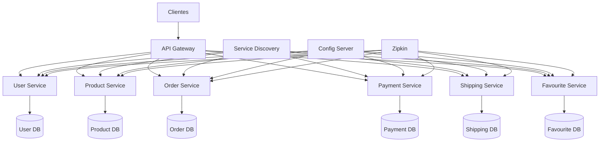
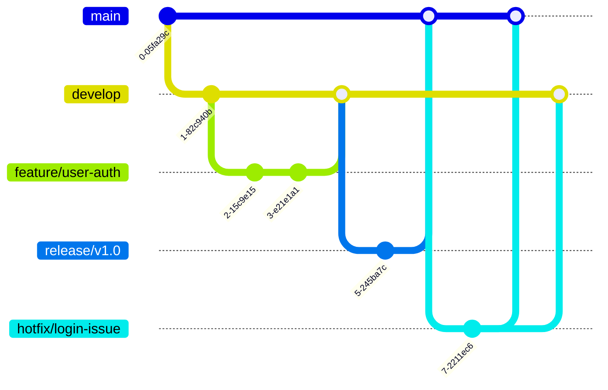
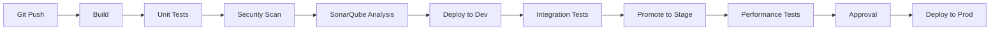

# Ecommerce Microservices - Proyecto Final IngeSoft V


## 📝 Descripción del Proyecto

Implementación de una plataforma de e-commerce basada en microservicios desplegada en Google Cloud Platform (GCP) utilizando Kubernetes (GKE). El proyecto incluye:

- **8 microservicios** principales
- **Infraestructura como código** con Terraform
- **CI/CD automatizado** con Jenkins
- **Monitoreo y observabilidad** con Prometheus, Grafana y Zipkin
- **Metodología ágil** (Scrum) con Jira
- **Patrones de diseño** avanzados para resiliencia y configuración

## 🏗️ Arquitectura del Sistema

### Diagrama de Componentes



### Tecnologías Principales

| Componente       | Tecnologías                                                                 |
|------------------|-----------------------------------------------------------------------------|
| Backend          | Spring Boot, Spring Cloud (Gateway, Config, Eureka), JPA, REST API          |
| Frontend         | No implementado en este proyecto (API-only)                                 |
| Base de Datos    | PostgreSQL (Cloud SQL)                                                      |
| Infraestructura  | Terraform, Google Cloud Platform (GKE, Cloud SQL, VPC)                      |
| CI/CD            | Jenkins, Docker, Kubernetes                                                 |
| Monitoreo        | Prometheus, Grafana, Zipkin                                                 |
| Seguridad        | Spring Security, JWT, RBAC                                                  |
| Pruebas          | JUnit, Mockito, TestContainers, Locust                                      |

## 🚀 Metodología Ágil Implementada

### Scrum Adaptado

- **Roles**:
  - Product Owner: Dylan Bermudez Cardona
  - Scrum Master: Dylan Bermudez Cardona (rol dual)
  - Development Team: Dylan Bermudez Cardona y Victor Manuel Garzon Meneses

- **Sprints Ejecutados**:
  - **Sprint 1**: Infraestructura Base (1 semana) - 8 Story Points
  - **Sprint 2**: Microservicios Core (1 semana) - 15 Story Points

- **Ceremonias**:
  - Sprint Planning semanal
  - Daily Standup cada 2 días
  - Sprint Review y Retrospective al final de cada sprint

### Gestión con Jira

- Tablero Scrum con historias de usuario priorizadas
- Seguimiento de velocidad (Velocity: 8 → 15 SP)
- Definición de Done clara con criterios de aceptación

## 🌿 Estrategia de Branching

### GitFlow Adaptado



- **Branches principales**:
  - `main`: Producción (requiere PR + review)
  - `develop`: Integración continua
  - `staging`: Testing pre-producción

- **Branches de soporte**:
  - `feature/[epic]/[descripción]`: Nuevas funcionalidades
  - `release/v[version]`: Preparación para release
  - `hotfix/[descripción]`: Fixes críticos en producción
  - `bugfix/[descripción]`: Corrección de bugs no críticos

## 🛠️ Infraestructura como Código

### Terraform en GCP

```hcl
module "gke_cluster" {
  source = "terraform-google-modules/kubernetes-engine/google"
  
  project_id        = var.project_id
  name             = "ecommerce-cluster"
  region           = "us-central1"
  zones            = ["us-central1-a"]
  network          = google_compute_network.vpc.name
  subnetwork       = google_compute_subnetwork.subnet.name
  
  node_pools = {
    default = {
      machine_type = "e2-medium"
      node_count   = 3
    }
  }
}
```

**Módulos implementados**:
- VPC y subredes
- Google Kubernetes Engine (GKE)
- Cloud SQL (PostgreSQL)
- Cloud Memorystore (Redis)
- Service Accounts y IAM

**Ambientes**:
- **Dev**: Recursos mínimos (e2-micro, db-f1-micro)
- **Stage**: Configuración similar a producción (e2-small, db-g1-small)
- **Prod**: Alta disponibilidad (e2-standard-2, db-n1-standard-1)

## 🧩 Patrones de Diseño Implementados

### 1. Circuit Breaker Pattern
- **Propósito**: Prevenir cascadas de fallos
- **Implementación**: Resilience4j en payment-service, user-service y product-service
- **Configuración**:
  ```yaml
  resilience4j.circuitbreaker:
    instances:
      paymentService:
        failureRateThreshold: 50
        waitDurationInOpenState: 5s
  ```

### 2. External Configuration Pattern
- **Propósito**: Configuración centralizada sin redeploy
- **Implementación**: Spring Cloud Config Server
- **Características**:
  - Configuración por ambiente (dev, stage, prod)
  - Refresh sin reinicio (`/actuator/refresh`)
  - Versionado en Git

### 3. API Gateway Pattern
- **Propósito**: Punto único de entrada
- **Implementación**: Spring Cloud Gateway
- **Funcionalidades**:
  - Routing dinámico
  - Rate limiting
  - Autenticación centralizada
  - Logging de requests

### 4. Service Registry Pattern
- **Propósito**: Descubrimiento automático de servicios
- **Implementación**: Eureka Server
- **Beneficios**:
  - Auto-registro de microservicios
  - Balanceo de carga automático
  - Health checks integrados

## 🔄 CI/CD Pipeline

### Flujo de Jenkins



**Etapas principales**:
1. **Build**: Compilación de microservicios con Maven/Gradle
2. **Test**:
   - Unit tests (cobertura > 80%)
   - Integration tests (TestContainers)
   - Security scan (Trivy)
3. **Analysis**: SonarQube para calidad de código
4. **Deploy**:
   - Dev: Automático tras tests
   - Stage: Requiere tests de integración exitosos
   - Prod: Requiere aprobación manual
5. **Monitor**: Health checks y métricas post-deploy

**Tecnologías clave**:
- Jenkins Pipeline (Jenkinsfile)
- Docker para empaquetado
- Kubernetes para orquestación
- Helm para templates de deploy

## 🧪 Pruebas Implementadas

### Matriz de Pruebas

| Tipo de Prueba       | Tecnologías          | Cobertura         | Ejecución        |
|-----------------------|----------------------|-------------------|------------------|
| Unitarias             | JUnit, Mockito       | 84.2% promedio    | En cada commit   |
| Integración           | TestContainers       | 23 casos          | Nightly builds   |
| E2E                   | Postman, RestAssured | 5 flujos completos| Pre-release      |
| Performance           | Locust               | <200ms response   | Semanal          |
| Seguridad             | Trivy, OWASP ZAP     | 0 vulnerabilidades| En cada pipeline |

### Ejemplo de Test de Integración

```java
@Test
@DisplayName("Cuando creo orden con productos válidos, entonces se debe reservar stock")
void createOrder_ValidProducts_ShouldReserveStock() {
    // Arrange
    OrderRequest request = new OrderRequest(1L, List.of(
        new OrderItem(1L, 2), // Product ID 1, quantity 2
        new OrderItem(2L, 1)  // Product ID 2, quantity 1
    );
    
    // Act
    OrderResponse response = orderService.createOrder(request);
    
    // Assert
    verify(productServiceClient, times(1))
        .reserveStock(1L, 2);
    verify(productServiceClient, times(1))
        .reserveStock(2L, 1);
    assertThat(response.getStatus()).isEqualTo(OrderStatus.PENDING);
}
```

## 📊 Observabilidad y Monitoreo

### Stack Implementado

| Herramienta    | Propósito                          | URL de Acceso                     |
|----------------|------------------------------------|-----------------------------------|
| Prometheus     | Recolección de métricas           | http://34.136.165.219:9090       |
| Grafana        | Visualización de dashboards       | http://104.197.80.211:3000       |
| Zipkin         | Tracing distribuido               | http://34.67.143.112:9411        |
| Locust         | Pruebas de performance            | http://35.232.180.42:8089        |

### Métricas Clave Monitoreadas

1. **Microservicios**:
   - Tasa de errores por endpoint
   - Tiempo de respuesta (p95, p99)
   - Uso de CPU/memoria

2. **Circuit Breakers**:
   - Estado (OPEN/CLOSED/HALF-OPEN)
   - Tasa de fallos
   - Llamadas rechazadas

3. **Bases de Datos**:
   - Conexiones activas
   - Consultas lentas
   - Uso de almacenamiento

4. **Kubernetes**:
   - Pods en ejecución
   - Uso de recursos
   - Eventos del cluster

## 🔒 Seguridad

### Medidas Implementadas

1. **Autenticación/Autorización**:
   - JWT con Spring Security
   - Roles (USER, ADMIN)
   - OAuth2 para futuras integraciones

2. **Protección de APIs**:
   - Rate limiting en API Gateway
   - Validación de inputs
   - Sanitización de outputs

3. **Infraestructura**:
   - VPC con subredes privadas
   - Firewall rules restrictivas
   - Workload Identity en GKE

4. **Secrets Management**:
   - Credenciales en Google Secret Manager
   - Encriptación en tránsito (TLS)
   - Rotación automática de claves

5. **Escaneo Continuo**:
   - Trivy para vulnerabilidades en imágenes
   - OWASP Dependency Check en builds
   - SonarQube para código seguro

## 📚 Documentación Adicional

1. [Historias de Usuario](user-stories.md)
2. [Metodología Ágil](agile-methodology.md)
3. [Patrones de Diseño](implemented-patterns.md)
4. [Arquitectura de Infraestructura](architecture.md)
5. [Manual de Operaciones](operations-guide.md)

## 🏁 Cómo Empezar

### Requisitos Previos

- Google Cloud Account
- Terraform >= 1.2
- kubectl >= 1.23
- Docker >= 20.10
- Java 11

### Despliegue Local

```bash
# 1. Clonar repositorio
git clone https://github.com/SelimHorri/ecommerce-microservice-backend-app.git
cd ecommerce-microservice-backend-app

# 2. Iniciar infraestructura local (Docker Compose)
docker-compose -f compose.yml up -d

# 3. Construir microservicios
./mvnw clean package

# 4. Ejecutar microservicios
java -jar user-service/target/user-service.jar
java -jar product-service/target/product-service.jar
# ... otros servicios
```

### Despliegue en GCP

```bash
# 1. Inicializar Terraform
terraform init -backend-config=backend.hcl

# 2. Planear infraestructura
terraform plan -var-file=dev.tfvars

# 3. Aplicar cambios
terraform apply -var-file=dev.tfvars

# 4. Configurar kubectl
gcloud container clusters get-credentials ecommerce-cluster --zone us-central1-a

# 5. Desplegar aplicaciones
kubectl apply -f k8s/
```

## 📞 Soporte y Contacto

Para problemas o preguntas, contactar a:

- **Dylan Bermudez Cardona** - dylan.bermudez@correo.escuelaing.edu.co
- **Victor Manuel Garzon Meneses** - victor.garzon@correo.escuelaing.edu.co

---

**Licencia**: MIT  
**Última Actualización**: Junio 2023  
**Versión**: 1.0.0
