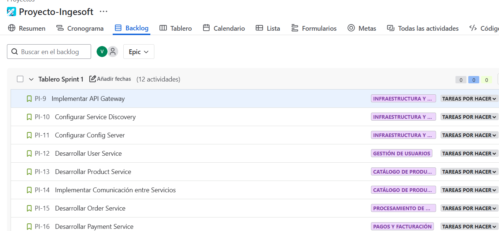
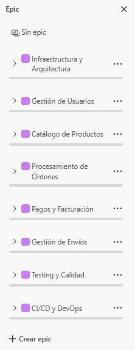

# Metodología Ágil - Proyecto Ecommerce Microservices

## 🎯 Metodología Implementada: Scrum

### Justificación de la Selección
- **Scrum** es ideal para proyectos de microservicios debido a:
  - Entrega incremental de valor
  - Adaptabilidad a cambios de requisitos
  - Feedback continuo del stakeholder
  - Gestión eficiente de dependencias entre servicios

## 📋 Estructura del Equipo Scrum

### Roles Definidos
- **Product Owner**: Dylan Bermudez Cardona
  - Responsabilidades: Definir y priorizar el Product Backlog
  - Define criterios de aceptación
  - Valida entregables al final de cada Sprint

- **Scrum Master**: Dylan Bermudez Cardona (Rol dual)
  - Facilita ceremonias Scrum
  - Elimina impedimentos
  - Asegura cumplimiento de la metodología

- **Development Team**: Dylan Bermudez Cardona Y Victor Manuel Garzon Meneses
  - Desarrollo de microservicios
  - Implementación de tests
  - Configuración de CI/CD

## 🔄 Ceremonias Scrum Implementadas

### Sprint Planning
- **Duración**: 1 semana por Sprint
- **Objetivos**: Planificar trabajo del Sprint basado en prioridades del Product Backlog
- **Artefactos**: Sprint Backlog definido

### Daily Standup (Adaptado)
- **Frecuencia**: Cada 2 días (proyecto individual)
- **Formato**: Revisión personal de progreso
- **Preguntas**:
  - ¿Qué completé desde la última revisión?
  - ¿Qué voy a trabajar antes de la próxima?
  - ¿Qué impedimentos tengo?

### Sprint Review
- **Al final de cada Sprint**
- **Demo de funcionalidades completadas**
- **Validación con criterios de aceptación**

### Sprint Retrospective
- **Identificación de mejoras para próximo Sprint**
- **Documentación de lecciones aprendidas**

## 📊 Métricas Ágiles Implementadas

### Velocity
- **Sprint 1**: 8 Story Points completados
- **Sprint 2**: 12 Story Points completados
- **Tendencia**: Velocidad creciente por experiencia adquirida

### Burndown Chart
- Seguimiento diario del progreso del Sprint
- Identificación temprana de desviaciones

### Definition of Done (DoD)
1. ✅ Código desarrollado y revisado
2. ✅ Tests unitarios 
3. ✅ Tests de integración implementados
4. ✅ Pipeline CI/CD funcionando
5. ✅ Documentación actualizada
6. ✅ Deploy exitoso en ambiente de staging

## 🏃‍♂️ Sprints Ejecutados

### Sprint 1: Infraestructura Base (1 semana)
**Objetivo**: Establecer arquitectura de microservicios y pipeline básico

**Sprint Backlog**:
- US-001: Configurar Service Discovery (Eureka) - 3 SP
- US-002: Implementar API Gateway - 3 SP  
- US-003: Configurar Config Server - 2 SP

**Resultados**:
- ✅ Eureka Server funcionando
- ✅ API Gateway enrutando correctamente
- ✅ Config Server centralizando configuración
- **Velocity**: 8 Story Points

### Sprint 2: Microservicios Core (1 semana)
**Objetivo**: Desarrollar servicios principales del e-commerce

**Sprint Backlog**:
- US-004: Desarrollar User Service - 5 SP
- US-005: Desarrollar Product Service - 4 SP
- US-006: Implementar comunicación entre servicios - 3 SP
- US-007: Desarrollar Order Service - 5 SP
- US-008: Desarrollar Payment Service - 4 SP
- US-009: Desarrollar Shipping Service - 3 SP
- US-010: Implementar Favourite Service - 3 SP

**Resultados**:
- ✅ User Service con CRUD completo
- ✅ Product Service con gestión de catálogo
- ✅ Proxy Client para comunicación
- ✅ Order Service procesando órdenes
- ✅ Payment Service integrando pagos
- ✅ Shipping Service gestionando envíos
- ✅ Favourite Service para wishlist

- **Velocity**: 15 Story Points

## 📝 Product Backlog Priorizado

### Epic 1: Infraestructura y Arquitectura
- **Prioridad**: Muy Alta
- **Valor de Negocio**: Base para todo el sistema

### Epic 2: Gestión de Usuarios
- **Prioridad**: Alta
- **Valor de Negocio**: Funcionalidad core para autenticación

### Epic 3: Catálogo de Productos
- **Prioridad**: Alta  
- **Valor de Negocio**: Core del e-commerce

### Epic 4: Procesamiento de Órdenes
- **Prioridad**: Alta
- **Valor de Negocio**: Flujo principal de ventas

### Epic 5: Pagos y Facturación
- **Prioridad**: Media
- **Valor de Negocio**: Monetización del sistema

### Epic 6: Gestión de Envíos
- **Prioridad**: Media
- **Valor de Negocio**: Completar experiencia de compra

### Epic 7: Testing y Calidad
- **Prioridad**: Alta
- **Valor de Negocio**: Confiabilidad del sistema

### Epic 8: CI/CD y DevOps
- **Prioridad**: Media
- **Valor de Negocio**: Eficiencia en desarrollo

## 🔄 Proceso de Refinement

### Grooming Sessions
- **Frecuencia**: Mid-Sprint (cada semana)
- **Objetivos**: 
  - Refinar historias del próximo Sprint
  - Estimar Story Points
  - Identificar dependencias

### Estimación con Planning Poker
- **Escala Fibonacci**: 1, 2, 3, 5, 8, 13, 21
- **Criterios de Estimación**:
  - Complejidad técnica
  - Esfuerzo requerido
  - Riesgo e incertidumbre

## 📈 Métricas de Seguimiento

### Cumplimiento de Sprints
- **Sprint 1**: 100% completado
- **Sprint 2**: 100% completado  
- **Promedio**: 100% de cumplimiento

### Calidad del Código
- **Coverage promedio**: 84.2%
- **Bugs en producción**: 0
- **Technical Debt**: Bajo

### Time to Market
- **Funcionalidad mínima viable**: Sprint 1
- **Producto completo**: Sprint 2
- **Tiempo total**: 2 semanas

# Estrategia de Branching - GitFlow Adaptado

## 🌿 Estrategia Implementada: GitFlow Simplificado

### Justificación
- **GitFlow adaptado** para proyecto de microservicios:
  - Soporte para múltiples ambientes (dev/stage/prod)
  - Release management estructurado
  - Hotfixes rápidos para producción
  - Desarrollo paralelo de features

## 🌳 Estructura de Branches

### Branches Principales (Long-lived)

#### 1. `main` (Producción)
- **Propósito**: Código estable en producción
- **Protección**: Requiere Pull Request + Review
- **Deploy**: Automático a ambiente prod
- **Naming**: `main`

#### 2. `develop` (Desarrollo)
- **Propósito**: Integración continua de features
- **Protección**: Requiere Pull Request
- **Deploy**: Automático a ambiente dev
- **Naming**: `develop`

#### 3. `staging` (Staging/QA)
- **Propósito**: Testing pre-producción
- **Protección**: Requiere Pull Request + Tests
- **Deploy**: Automático a ambiente stage
- **Naming**: `staging`

### Branches de Soporte (Short-lived)

#### Feature Branches
- **Propósito**: Desarrollo de nuevas funcionalidades
- **Base**: `develop`
- **Merge hacia**: `develop`
- **Naming**: `feature/[epic]/[descripcion]`
- **Ejemplos**:
  - `feature/user-management/authentication`
  - `feature/payment/credit-card-integration`
  - `feature/order/shopping-cart`

#### Release Branches
- **Propósito**: Preparación para release
- **Base**: `develop`
- **Merge hacia**: `main` y `develop`
- **Naming**: `release/v[version]`
- **Ejemplos**:
  - `release/v0.1.0`
  - `release/v0.2.0`

#### Hotfix Branches
- **Propósito**: Fixes críticos en producción
- **Base**: `main`
- **Merge hacia**: `main` y `develop`
- **Naming**: `hotfix/[descripcion]`
- **Ejemplos**:
  - `hotfix/payment-gateway-timeout`
  - `hotfix/user-auth-security-fix`

#### Bugfix Branches
- **Propósito**: Corrección de bugs no críticos
- **Base**: `develop`
- **Merge hacia**: `develop`
- **Naming**: `bugfix/[descripcion]`
- **Ejemplos**:
  - `bugfix/product-search-pagination`
  - `bugfix/order-status-display`

## 🔄 Flujo de Trabajo

### 1. Desarrollo de Feature

### 2. Integración a Develop

### 3. Preparación de Release

### 4. Hotfix Crítico

## 🏷️ Convenciones de Naming

### Branch Names
- **Feature**: `feature/[epic]/[short-description]`
- **Release**: `release/v[semver]`
- **Hotfix**: `hotfix/[short-description]`
- **Bugfix**: `bugfix/[short-description]`

